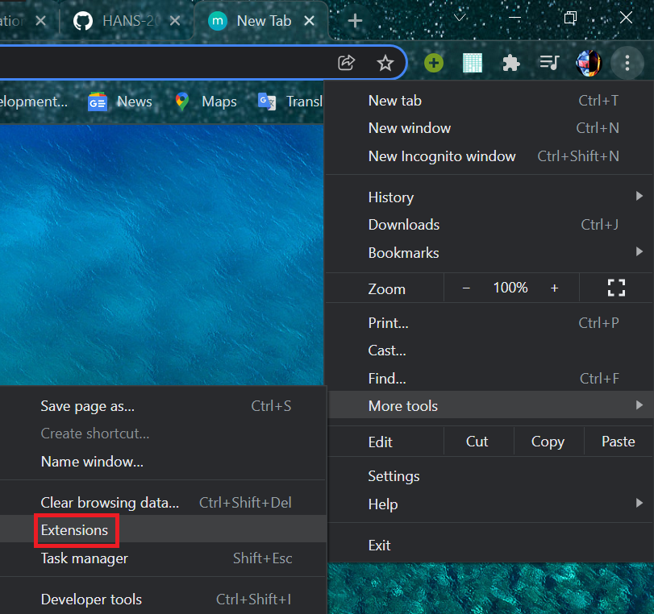
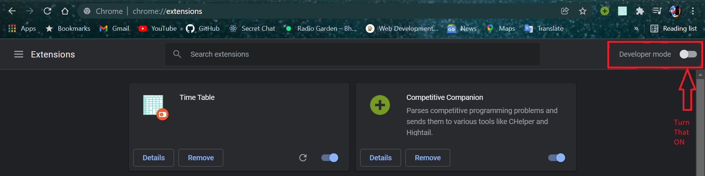
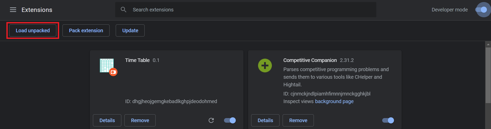
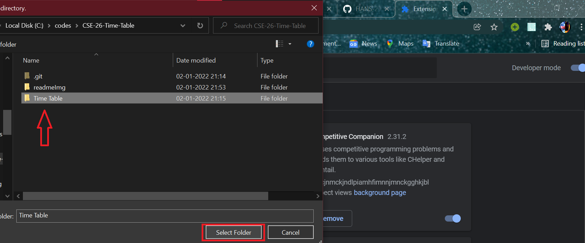
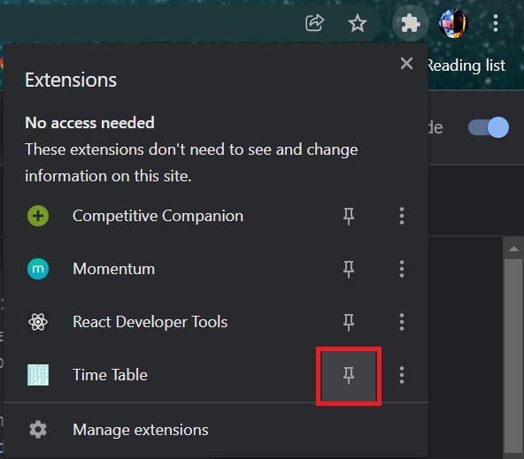
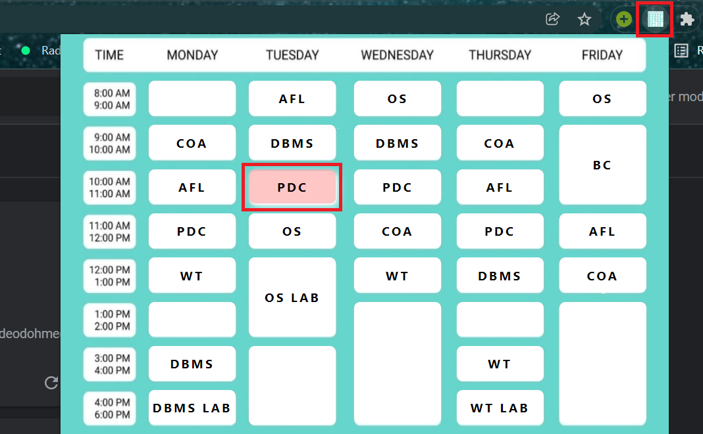

# CSE 26 Time Table
 Time Table Extension for CSE 26 (KIIT)
  
 For any query mail me via pattnaikhans@gmail.com
  
 In case you want to improve this time table please feel free to do so by opening an issue / PR .
 
 
# How to Setup
1) Clone this repository into your local system.

 
 

2) Go to your manage extensions setting of your chrome browser.
 
 

 
 

3) Now you have to enable the chrome developer mode like I have done below.
 
 

 
 

4) Click on **Load Unpacked** .
 
 

 
 

5) Now go to the folder you cloned the repository (in step 1) and select the **Time Table** folder.
 
 

 
 

6) And yeah that's it you have the extension ready to use. I do recommend pinning it in the extension tab for accessing it quickly.
 
 

 
 

# How to Use
* Click on the pinned extension and click on the subject at the particular day and time. There you go the meet link opens and you back to attending boredom. 
 
 

* **NOTE : In case class links change or link updates for those which haven't yet come , I will update them as soon as they change, you just have to fetch the latest update, everything else will be taken care of automatically unless you do something funky with the directory or the code**